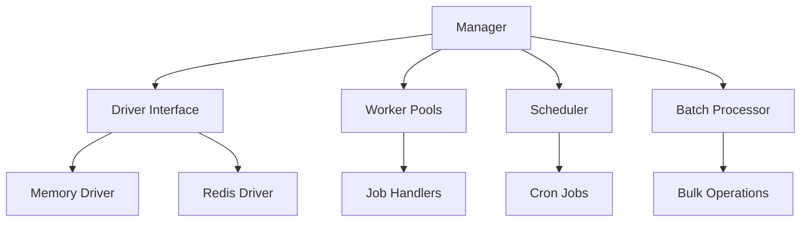
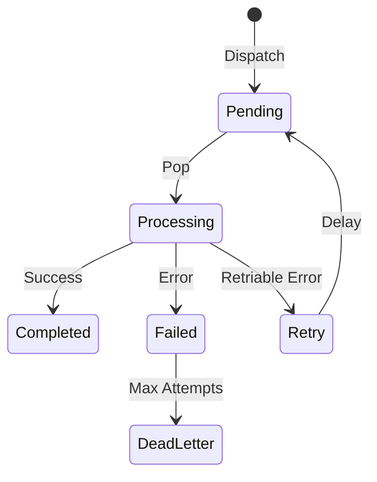

# Architecture

## Overview

dg-queue is a production-ready queue system designed for Go applications with a clean, extensible architecture.

## Core Components



## Component Details

### Manager

The `Manager` is the central coordinator that:
- Manages worker pools for different job types
- Routes jobs to appropriate workers
- Handles job lifecycle (dispatch, retry, fail)
- Provides graceful shutdown

**Key Methods:**
- `Dispatch(name, payload)` - Dispatch a job immediately
- `Worker(name, concurrency, handler)` - Register a job handler
- `Start(ctx)` / `Stop(ctx)` - Lifecycle management

### Driver Interface

Drivers provide storage abstraction for jobs:

```go
type Driver interface {
    Push(job *Job) error
    Pop(queueName string) (*Job, error)
    Delete(jobID string) error
    Retry(job *Job) error
    Failed(job *Job) error
    Get(jobID string) (*Job, error)
    Size(queueName string) (int64, error)
    Close() error
}
```

**Built-in Drivers:**
- **Memory** - In-memory FIFO queue (testing)
- **Redis** - Persistent queue with delayed jobs (production)

### Job Lifecycle



**Job States:**
- `Pending` - Waiting in queue
- `Processing` - Being executed by worker
- `Completed` - Successfully finished
- `Failed` - Execution failed
- `Retry` - Scheduled for retry

### Worker Pools

Each job type has its own worker pool:

```go
manager.Worker("send-email", 5, func(job *Job) error {
    // Process job
    return nil
})
```

**Features:**
- Configurable concurrency per job type
- Automatic job routing
- Graceful shutdown support

### Scheduler

Cron-based scheduler for recurring jobs:

```go
scheduler := NewScheduler(manager)
scheduler.ScheduleJob("*/5 * * * *", "cleanup", payload)
```

**Features:**
- Standard cron syntax
- Schedule management (add/remove)
- Integration with job queue

### Batch Processor

Efficient bulk operations:

```go
batch := NewBatch(manager)
batch.DispatchBatch("send-email", items, config)
```

**Features:**
- Chunking for large datasets
- Progress callbacks
- Error handling (continue-on-error)
- Rate limiting

## Design Patterns

### Dependency Injection

All components accept dependencies via constructors:

```go
manager := New(config)
manager.SetDriver(driver)
scheduler := NewScheduler(manager)
batch := NewBatch(manager)
```

### Interface-Based Design

Drivers implement the `Driver` interface, allowing easy swapping:

```go
// Development
manager.SetDriver(memory.NewDriver())

// Production
manager.SetDriver(redis.NewDriver("app", options))
```

### Shared Client Pattern

Redis driver supports shared clients to avoid connection overhead:

```go
client := redis.NewClient(&redis.Options{...})
cacheDriver := redisCache.NewDriverWithClient(client, "cache")
queueDriver := redisQueue.NewDriverWithClient(client, "queue")
```

## Thread Safety

- Manager is thread-safe (uses `sync.RWMutex`)
- Drivers must be thread-safe
- Job handlers run concurrently per worker pool

## Error Handling

**Retry Logic:**
- Automatic retries up to `MaxAttempts`
- Exponential backoff via `RetryDelay`
- Failed jobs move to dead letter queue

**Dead Letter Queue:**
- Jobs exceeding max attempts
- Jobs with no registered worker
- Stored for manual inspection/replay

## Performance Considerations

1. **Worker Concurrency** - Tune per job type
2. **Batch Size** - Balance memory vs throughput
3. **Connection Pooling** - Share Redis clients
4. **Queue Prefixes** - Separate apps on same Redis

## Extension Points

1. **Custom Drivers** - Implement `Driver` interface
2. **Middleware** - Add job processing hooks (planned v1.1)
3. **Job Chaining** - Sequential job execution (planned v1.1)
4. **Priority Queues** - Custom queue ordering (planned v1.1)
